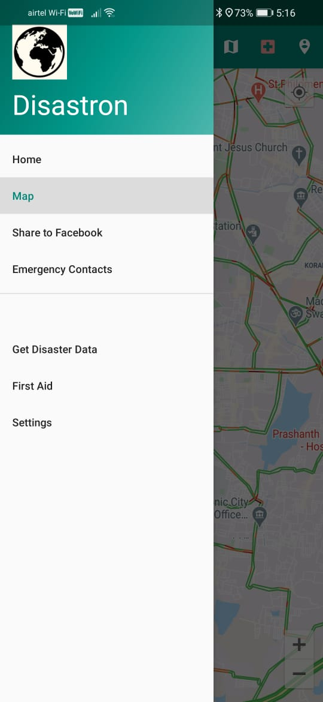
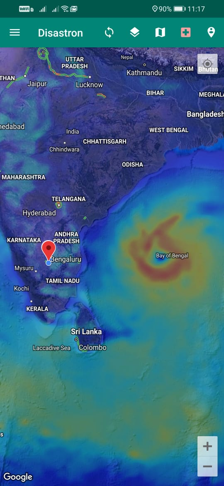
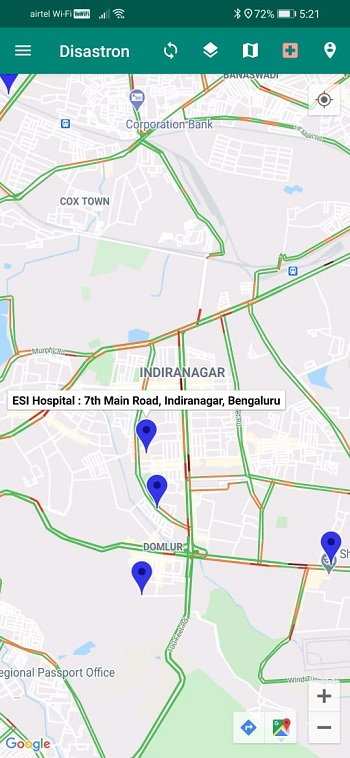
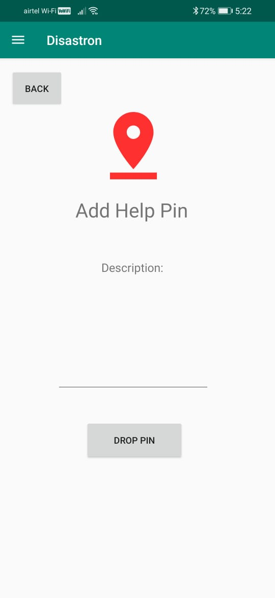
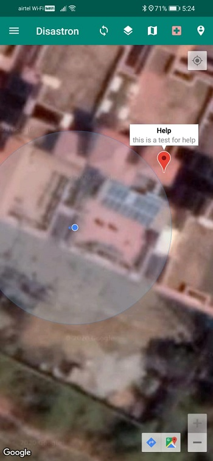
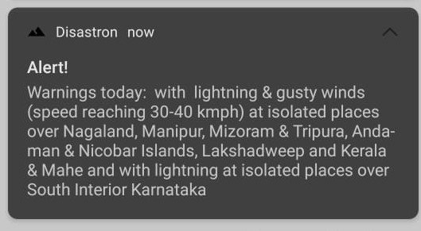
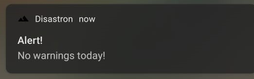

# Disastron - A Disaster Management Application for India

## Introduction

Disastron is an Indian Disaster Management Android Application, built with active disaster prevention features.
- Active disaster prediction notifications fetched from NDMA database based on your location.
- Social Media support to share disaster alert to people in the affected area using the Facebook SDK.
- Community based disaster tracking by pin pointing location on Shared Map using Firebase.
- Get nearby hospitals at the press of a button
- Crucial disaster management information available in the application.
- Contains different weather maps like air pressure, wind speed etc.

## Code Details

The app was built using Android Studio SDK.
1. Current location is fetched using Google Maps Reverse Geooding API.
2. Information regarding your current location is scraped from the NDMA Database.
3. Google Maps API to spread disaster location on Shared Community Map.
4. Facebook API to support push notifications to the people in the affected area.
5. Openweather API for live weather maps
6. Offline information available for severe conditions with no connectivity.

## Application features

### Menu

The menu can be seen in the following image:       

### Map

The map has multiple features which are going to be highlighted below:    

The icons from left to right are:

#### Reset map
Resets the map back to default settings.    

#### Map types
Allows selection between 4 map types: Normal, Satellite, Terrain, Hybrid.

#### Map layers
Allows the user to see maps like Clouds, Temperature, Precipitation, Snow, Rain etc.

An example of the wind speed layer during a hurricane can be seen below:

#### Nearby hospitals

Gets the location of the nearest hospitals with regard to the user

#### Help pins

This allows the user to drop help pins at their location with a description.

All pins are updated live using Firebase and here another user's pin can be seen:

### Disaster alerts

The disaster alerts are scraped from the NDMA website and are shown as follows.

When there is an alert in your area:

When there is no alert:

